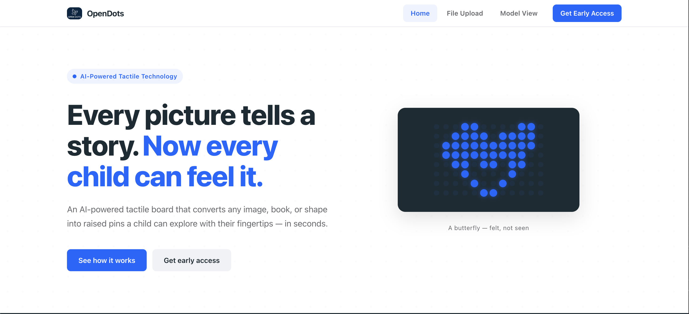
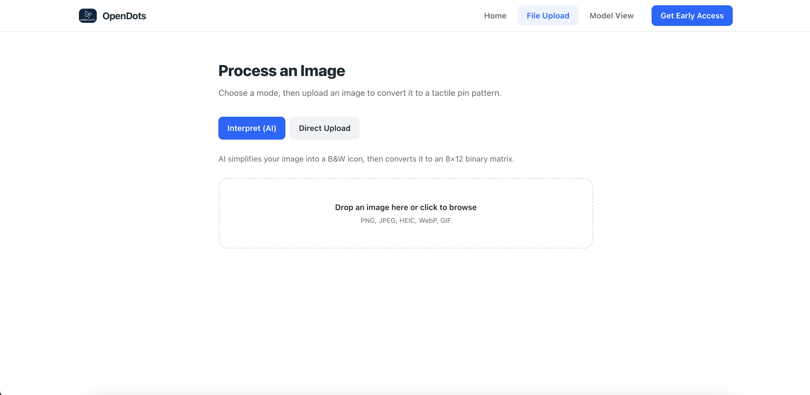
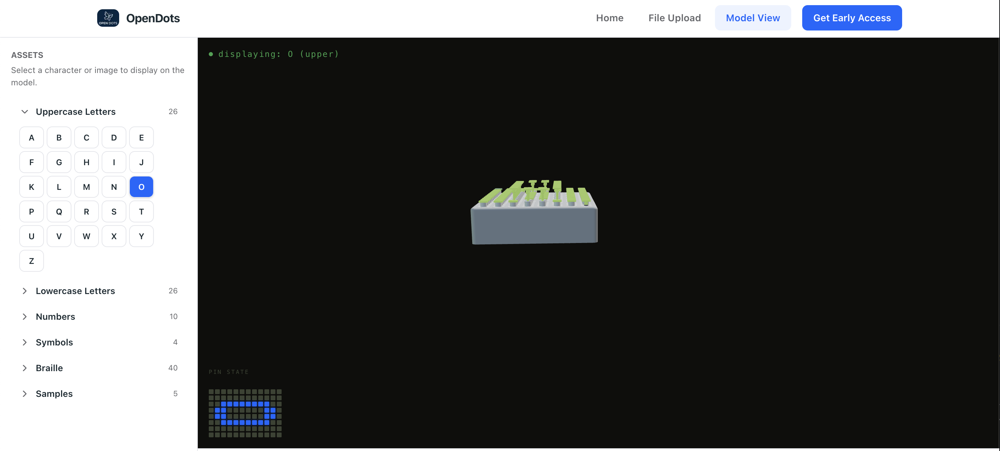

# OpenDots

**An AI-powered tactile display system that converts any image into a physical pin matrix — making visual content touchable for children with visual impairments.**

> *Every picture tells a story. Now every child can feel it.*


https://github.com/user-attachments/assets/d2a2d3b1-02c1-44f5-8e64-921d03617bcc


---

## The Problem

Over 2.2 billion people worldwide live with vision impairment. For children, this means missing out on the visual richness of books, classroom materials, and everyday images. Existing braille displays cost upward of $15,000 and only render text. OpenDots bridges this gap by turning *any* image into a tactile experience — instantly and affordably.

## What It Does

OpenDots takes any photograph, drawing, or symbol and converts it into an 8x12 binary pin matrix that can be rendered on a physical tactile board with 96 solenoid-driven pins. The system provides:

- **AI-powered image simplification** — Uses Google Gemini to distill complex images into high-contrast tactile-friendly icons
- **Direct image conversion** — Processes images through a monochrome/contrast/threshold pipeline for immediate matrix output
- **Interactive 3D visualization** — Real-time Three.js simulation of the physical pin board with smooth LERP animations
- **9 accessibility profiles** — Material presets for cortical visual impairment, visual snow syndrome, deuteranopia, protanopia, tritanopia, and more
- **Pre-built character libraries** — Latin alphabet, numerals, symbols, and Grade 1 braille, all rendered at tactile resolution

<p align="center">
  
</p>

## Architecture

```
┌─────────────────────────────────────────────────────────┐
│  Next.js Frontend (React 19 + TypeScript + Tailwind 4)  │
│  ┌──────────┐  ┌──────────┐  ┌────────────────────┐    │
│  │ Landing   │  │ Upload   │  │ 3D Model Viewer    │    │
│  │ Page      │  │ Page     │  │ (Three.js + GLB)   │    │
│  └──────────┘  └──────────┘  └────────────────────┘    │
│                      │                  │               │
│           ┌──────────┴──────────────────┘               │
│           v                                             │
│  ┌─────────────────────────────────┐                    │
│  │       Next.js API Routes        │                    │
│  │  /interpret  /direct-upload     │                    │
│  │  /assets     /assets/matrix     │                    │
│  └──────────────┬──────────────────┘                    │
└─────────────────┼───────────────────────────────────────┘
                  │ spawns Python CLI
                  v
┌─────────────────────────────────────────────────────────┐
│  Python Image Processing Pipeline                       │
│  ┌──────────┐  ┌──────────┐  ┌──────────────────────┐  │
│  │  Gemini   │  │  Pillow   │  │  8x12 Matrix        │  │
│  │  Simplify │──│  Process  │──│  Binarization        │  │
│  └──────────┘  └──────────┘  └──────────────────────┘  │
└─────────────────────────────────────────────────────────┘
```

## Tech Stack

| Layer | Technology |
|-------|-----------|
| **Frontend** | Next.js 16, React 19, TypeScript 5 |
| **3D Rendering** | Three.js (GLTFLoader, OrbitControls, PBR materials) |
| **Styling** | Tailwind CSS 4 |
| **Image Processing** | Python 3, Pillow, pillow-heif |
| **AI** | Google Gemini 2.5 Flash (two-stage simplification) |
| **API** | Next.js Route Handlers, Flask (asset serving) |

## Key Technical Highlights

**Two-Stage AI Simplification** — Rather than directly converting complex images, the pipeline first asks Gemini to identify the subject, then generates a purpose-built ultra-simplified icon with only pure black and white pixels — no gradients, no anti-aliasing. This produces dramatically cleaner binary matrices.

<p align="center">
  
</p>

**Real-Time 3D Simulation** — The Three.js viewer loads a GLB model of 96 individually addressable solenoid plungers. Pin heights animate via linear interpolation at configurable speed, with dynamic emissive glow intensity tied to average matrix activation. Nine material profiles swap colors, roughness, and metalness in real-time to simulate how the board appears under different visual conditions.

<p align="center">
  
</p>

**Accessibility-First Profiles** — Each visual profile is tuned to a specific condition: high-contrast white-on-black for cortical visual impairment, yellow emissive for visual snow syndrome, colorblind-safe palettes for deuteranopia/protanopia/tritanopia, and high-contrast variants for near/far sightedness.

## Project Structure

```
src/pins/                     # Core Python library
  image_processing.py         # Image ops: load, monochrome, contrast, trim, reorient
  matrix.py                   # 8x12 binary matrix conversion
  simplify.py                 # Gemini-based two-stage image simplification
  generators/                 # Character image generation (letters, braille)

cli/                          # Command-line entry points
  image_to_matrix.py          # Image -> binary matrix
  image_simplify.py           # Image -> simplified icon -> matrix
  generate_letters.py         # Batch letter/symbol rendering
  generate_braille.py         # Batch braille pattern rendering

frontend/
  src/app/                    # Next.js App Router pages
    page.tsx                  # Landing page
    upload/                   # Image upload (AI interpret + direct modes)
    model-view/               # Interactive 3D board viewer
    api/                      # Route handlers (interpret, direct-upload, assets)
  src/components/
    ThreeScene.tsx             # 3D solenoid grid (Three.js)
    DotGrid.tsx                # 2D animated dot matrix
    FileUpload.tsx             # Drag-and-drop upload
    AssetSidebar.tsx           # Asset library browser
    sections/                  # Landing page sections
```

## Getting Started

### Prerequisites

- Python 3.10+
- Node.js 20+
- A Google Gemini API key (for AI simplification)

### Setup

```bash
# Python dependencies
pip install -r requirements.txt

# Frontend dependencies
cd frontend && npm install

# Environment
echo "GEMINI_API_KEY=your_key_here" > .env
```

### Run

```bash
# Start the frontend
cd frontend && npm run dev

# Or use the CLI directly
python -m cli.image_to_matrix assets/samples/castle.png
python -m cli.image_simplify assets/samples/castle.png --output output/

# Generate character libraries
python -m cli.generate_letters --all
python -m cli.generate_braille --all
```

### CLI Options

```bash
python -m cli.image_to_matrix <image> \
  --orientation landscape \
  --contrast 3.0 \
  --threshold 100 \
  --trim \
  --invert
```

## How the Pipeline Works

1. **Input** — User uploads any image (PNG, JPEG, HEIC, WebP, GIF)
2. **Simplify** *(optional)* — Gemini identifies the subject, then generates a chunky black-and-white icon
3. **Process** — Convert to grayscale, enhance contrast (2x default), optionally trim and reorient
4. **Binarize** — Resize to 8x12 pixels, apply brightness threshold to produce a binary matrix
5. **Render** — Display as an animated 2D dot grid or drive the 3D solenoid simulation

## License

All rights reserved.
